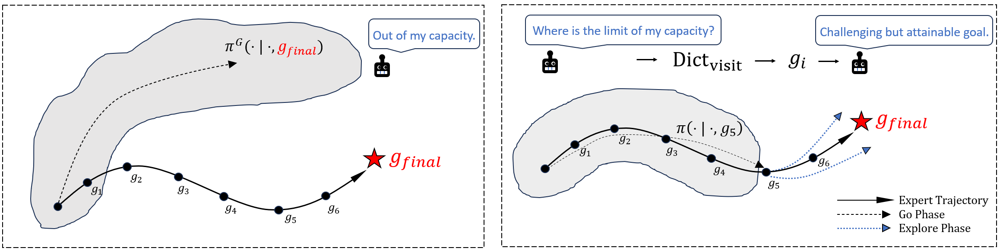
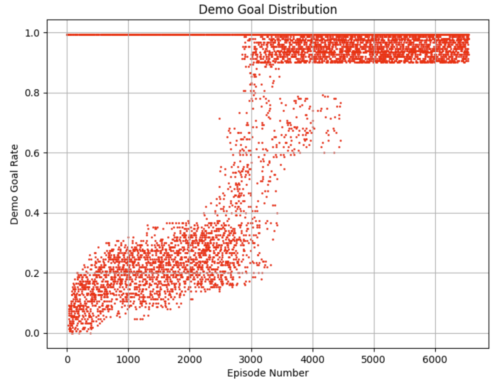
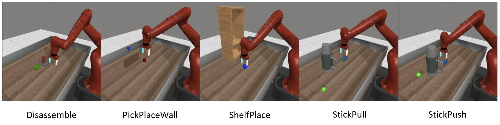
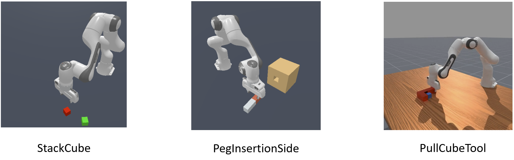
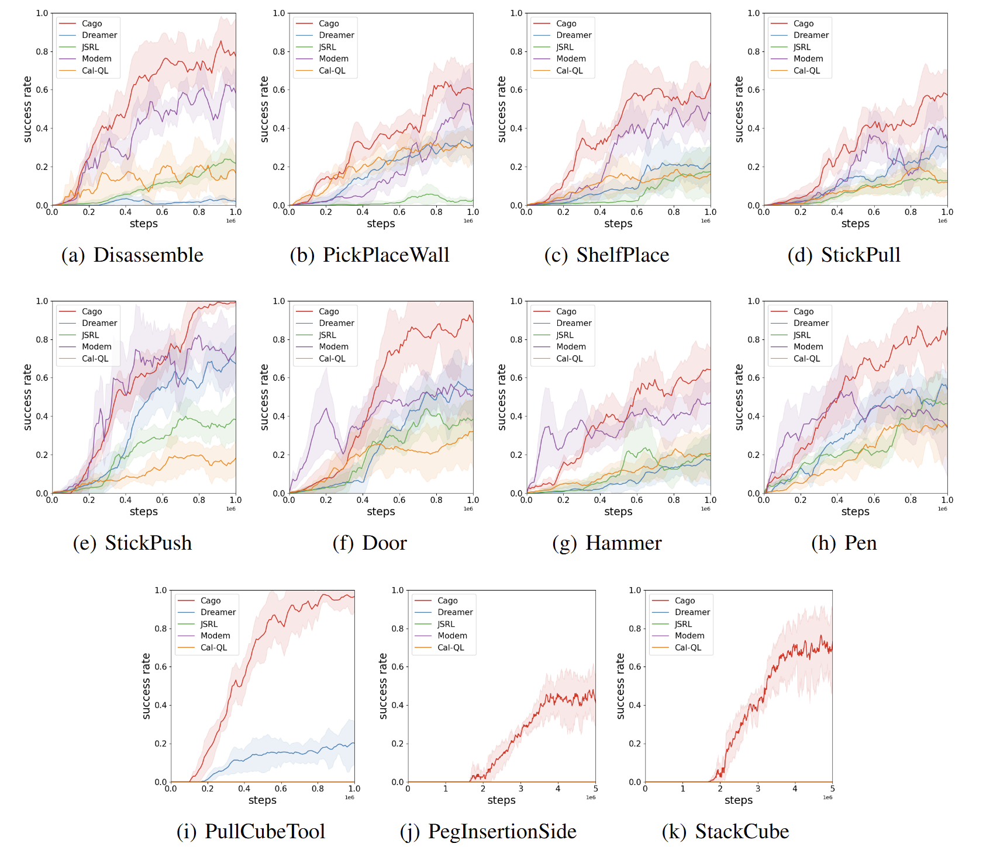

# Learning from Demonstrations via Capability-Aware Goal Sampling (Cago)
Yuanlin Duan, Yuning Wang, Wenjie Qiu and He Zhu

Paper Link: 

Code for "Learning from Demonstrations via Capability-Aware Goal Sampling" (NeurIPS 2025).

If you find our paper or code useful, please reference us:
```

```

## Cago Framework:

Cago (Capability-Aware Goal Sampling) is a new learning-from-demonstrations framework that explicitly aligns the agent’s learning process with its evolving capabilities. Unlike prior methods that use demonstrations for direct imitation, reward shaping, or offline pretraining, Cago treats demonstrations as structured roadmaps. It continuously monitors which parts of a demonstration the agent can already reach and leverages this signal to sample intermediate goal states in the demonstration, those at the boudary of the agent’s current goal-reaching capabilities. At each episode, a goal-conditioned agent first attempts to reach the sampled goal and then explores forward from it, generating informative, task-relevant data for policy optimization. This iterative process of capability-aware goal selection and curriculum-aligned exploration enables steadily progress toward solving the full task.




An example of the progress of capability-aware goal sampling in MetaWorld StickPush:



## Cago Goal Predictor

At training time, the goal-conditioned policy $\pi^G(\cdot \mid \cdot, g)$ is trained using intermediate states from demonstration trajectories as goal conditions. This assumes access to demonstrations, with the final states used as the target goal condition. However, at test time, this assumption no longer holds: for unseen scenarios, the true final goal state is not available. We use a goal predictor $\mathcal{P}_\phi$, a learned model that infers a goal state $\hat{g}$ given the current observation $s$.


## Experiment environments

For our experiments, we evaluate and compare Cago against several baselines across three robot environment suites with sparse rewards: [MetaWorld](https://github.com/Farama-Foundation/Metaworld), [Adroit](https://robotics.farama.org/envs/adroit_hand/), and [Maniskill](https://maniskill.readthedocs.io/en/latest/user_guide/index.html).




| Env-AdroitHand | Env-Maniskill |
|----------------|---------------|
|  |  |

## Experiment results

Cago presents a new paradigm to utilize demonstrations: it dynamically tracks the agent's competence along demonstrated trajectories and uses this signal to select intermediate states in the demonstrations that are just beyond the agent's current reach as goals to guide online trajectories collecting. To evaluate this novel perspective, we compared Cago against state-of-the-art baselines that represent diverse strategies for learning from demonstrations.




## Code Structure

```
Cago/
  |- Config/                         # config file for each environment.
  |- dreamerv2_demo/                 # Dreamer-v2 MBRL cornerstone
  |- dreamerv2_demo/gc_goal_picker   # Cago goal picking strategy implementation
  |- dreamerv2_demo/Goal_Predictor   # Cago goal predictor for evaluation
  |- dreamerv2_demo/gc_main.py       # Main running file
```


### Installation

Build the conda environments:

```bash
conda env create -f environment.yml
```

And then, run:

```bash
pip install -e .
```

### Download Demonstrations

You can download all demonstrations we used through:

```bash
https://drive.google.com/file/d/1kqchtLKaNnz5eVAQUAjteoVPYzGpmIVD/view?usp=sharing
```

Then unzip it to a folder called Demo under Cago/.


### Run Cago

Training Scripts:

```bash
python dreamerv2_demo/gc_main.py --configs Meta_Disassemble(environment name in config file) --gpu_index 0 --demo_search_strategy 21 --expl_behavior 'Demo_BC_Explorer' --train_every 1 --steps 1000000 --logdir "your logdir path"
```

Use the tensorboard to check the results.

```bash
tensorboard --logdir ~/logdir/your_logdir_name
```

## Acknowledgements
Cago builds on many prior works, and we thank the authors for their contributions.

- [PEG](https://github.com/penn-pal-lab/peg) for the goal-cond MBRL Agent and goal picking for exploration implement
- [Dreamerv2](https://github.com/danijar/dreamerv2) for the non-goal-cond. MBRL agent
- [LEXA](https://github.com/orybkin/lexa) for goal-cond. policy training logic